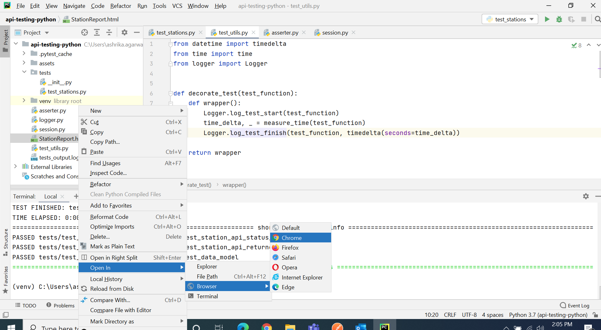

<h1 align="center">PyRestAPITest</h1>

<p align="center">  
This application is built to do REST API testing using python scripts along with the use of Pytest module as our testing framework.
</p>

<p align="center">
  <a href="https://opensource.org/licenses/Apache-2.0"></a>
</p>

# Demo


## Languages, libraries and tools used

* __[Python](https://www.python.org/downloads/)__
* __[Pytest](https://docs.pytest.org/en/6.2.x/getting-started.html)__
* __[Requests](https://docs.python-requests.org/en/master/)__
* __[JsonPath](https://pypi.org/project/jsonpath/)__
* __[Pycharm](https://www.jetbrains.com/pycharm/download/)__

Above Features are used to make code simple, generic, understandable, clean and easily maintainable for future development.

## Installation

Install the dependencies and start the testing.

 __Install Pytest__:
```sh
pip install -U pytest
```
 __Install Requests__:
```sh
pip install requests
```

 __Install Json Path__:
```sh
pip install jsonpath
```
## Automated tests

__To run a test, you can simply write the following command on Terminal__:
```sh
pytest
```

__To run and get details of all the executed test, you can simply write the following command on Terminal__:
```sh
pytest -rA
```

__To run and generate full HTML details report of all the executed test, you can simply write the following commands on Terminal__:

__But first install [Pytest-HTML](https://pypi.org/project/pytest-html/) by writing the following command on Terminal__
```sh
pip install pytest-html
```
__Then write the following command on Terminal__
```sh
pytest --html==YOUR_REPORT_FILE_NAME.html
```

__To see the reports, open the Project window, and then right-click then click on refresh then right-click on __StationReport.html__ to open the file on the default browser.__



# Prerequisites
* __Python__
* __Any IDE__

# Built With

* __[Python](https://www.python.org/downloads/)__ - Language used to build the application.
* __[Pycharm](https://www.jetbrains.com/pycharm/download/)__ - The IDE for writing Automation Test Scripts
